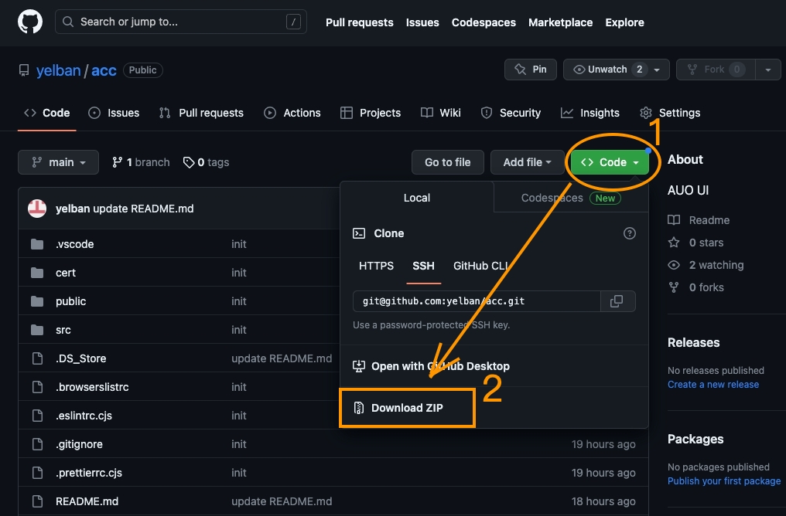

# AUO UI

這是 Vue/Vite 的範例專案，內容是初代的 AUO Reshape 風格基礎版型，包含一個基本的 Response 表格列表，版型基於 TailwindCSS 設計，方便持續彈性調整。

## 使用方式

### 本地專案克隆

##### 方法一，下載 zip 檔到本地解壓

ZIP 下載 [範例專案] (https://github.com/yelban/acc)

##### 方法二，使用 Git 命令，公司內網需設置當地網路外連 Proxy

GIT 下載 [範例專案] (https://github.com/yelban/acc)

    git clone git@github.com:yelban/acc.git
    cd acc
    npm i
    npm run dev

### 複製需要的 HTML

線上版本請見 [範例網站](https://acc-u8ey.onrender.com/)
